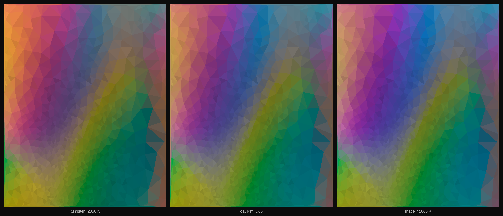

# Under Another Light

*A tessellation in which no colour is ever chosen.*



Every cell in this tessellation owns a **reflectance spectrum**, not a colour.
The colour you see is what happens when a light source meets that spectrum and
a human eye integrates the product. Change the light and the geometry holds
still while the entire palette moves — because the palette was never in the
artwork. It was in the room.

The three panels above are the *same* piece — same seed, same geometry, same
spectra — rendered under a tungsten lamp (2856 K), average daylight (D65), and
deep shade (12000 K).

## How it works

- **Geometry.** Random points are rejection-sampled against a smooth density
  field, relaxed toward their Voronoi centroids (Lloyd's algorithm), and
  Delaunay-triangulated.
- **Reflectance.** Each cell gets a spectrum built from two Gaussian pigment
  families over wavelength: a *reflecting* band that returns a slice of the
  spectrum, and an *absorbing* notch that subtracts one — which is how magenta
  and every other non-spectral colour comes to exist. No wavelength is
  magenta; it is only green removed.
- **Colorimetry.** Spectrum × illuminant is integrated against the CIE 1931
  standard observer to get XYZ, chromatically adapted with CAT02 (the eye
  never fully discounts the light it lives under — `ADAPTATION = 0.55`), and
  encoded to sRGB.

The random seed is **1931**, the year the standard observer was defined.

## Run it

```bash
pip install -r requirements.txt
python under_another_light.py   # single render -> SVG + PNG
python composite.py             # three illuminants side by side
```

Change `LIGHT` in `under_another_light.py` (a colour temperature in kelvin, or
`"D65"`) to see the piece under another light.

---

Created for the PyCon Greece 2026 Call for Algorithmic Art.
